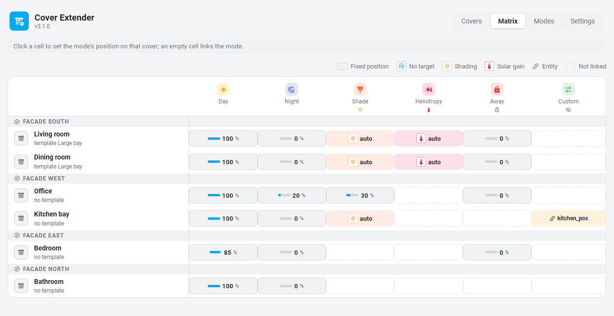

# Cover Extender

🇬🇧 [English version](README.md) (référence complète : entités, actions, événements)

Cover Extender est une intégration Home Assistant qui ajoute des **modes**, un **verrou**, une **mémoire de position** et de l'**automatisation solaire** (ombrage et héliotropie) aux volets que vous avez déjà. Elle ne remplace jamais vos entités `cover.*` : elle travaille autour d'elles, et tout se configure depuis son propre panneau d'administration.



**Ce que vous obtenez :**

- **Des modes** comme *Jour*, *Nuit*, *Ombre* ou *Absence*, chacun avec sa position pour chaque volet, changés depuis un sélecteur par volet ou depuis vos automatisations.
- **Un verrou** : tant qu'un mode verrouillant est actif, les positions demandées via Cover Extender sont mémorisées au lieu de bouger le volet, puis appliquées au déverrouillage.
- **Des exclusions** : une fenêtre ouverte (ou n'importe quelle entité à `on` de votre choix) bloque tout mouvement que Cover Extender ferait sur ce volet.
- **L'ombrage automatique** : le volet suit le soleil pour que la lumière directe n'entre pas plus loin dans la pièce que ce que vous avez décidé.
- **L'héliotropie** : par temps froid, ouvrir quand le soleil fait face à la fenêtre, fermer sinon.
- **Un panneau d'administration** avec une matrice modes × volets, des gabarits partagés par les fenêtres identiques, un rechargement à chaud à chaque enregistrement, en français et en anglais.

---

## Installation

Nécessite **Home Assistant 2026.1** ou plus récent, et des volets qui acceptent une position (de 0 à 100).

### Avec HACS (recommandé)

Cover Extender n'est pas encore dans la liste par défaut de HACS : ajoutez-le comme dépôt personnalisé.

[](https://my.home-assistant.io/redirect/hacs_repository/?owner=Pulpyyyy&repository=cover-extender&category=integration)

Ou à la main :

1. Dans Home Assistant, ouvrez **HACS**, puis le menu **⋮** (en haut à droite) et **Dépôts personnalisés**.
2. Dépôt : `https://github.com/Pulpyyyy/cover-extender`, type : **Intégration**, puis **Ajouter**.
3. Cherchez **Cover Extender** dans HACS, ouvrez-le et cliquez sur **Télécharger**.
4. **Redémarrez** Home Assistant.

### Manuellement

1. Téléchargez la dernière [version](https://github.com/Pulpyyyy/cover-extender/releases).
2. Copiez le dossier `custom_components/cover_extender/` dans le dossier `custom_components/` de votre configuration Home Assistant (créez-le au besoin).
3. **Redémarrez** Home Assistant.

### Ajouter l'intégration

[](https://my.home-assistant.io/redirect/config_flow_start/?domain=cover_extender)

Ou **Paramètres → Appareils et services → Ajouter une intégration**, puis cherchez **Cover Extender**. Il n'y a rien à remplir : l'intégration est créée et tout le reste se passe dans le panneau.

**Mise à jour depuis la 2.x :** la configuration est migrée automatiquement au premier démarrage. La migration est à sens unique : revenir en 2.x ensuite est refusé plutôt que de risquer de corrompre la configuration.

---

## Prise en main

Ce parcours configure un volet avec deux modes, *Jour* (ouvert) et *Nuit* (fermé). Comptez cinq minutes.

1. **Ouvrez le panneau.** Cliquez sur **Cover Extender** dans la barre latérale, ou sur le bouton de la page de l'intégration, ou allez sur `http://<votre-ha>:8123/cover-extender`. Le panneau est réservé aux administrateurs.
2. **Créez une façade.** Dans **Réglages → Façades**, cliquez sur **Ajouter une façade**. Nommez-la (par ex. *Sud*) et réglez son **azimut**, la direction vers laquelle regardent les fenêtres : 0° = nord, 90° = est, 180° = sud, 270° = ouest. Une application boussole posée à plat contre la fenêtre, en regardant dehors, donne la valeur.
3. **Créez deux modes.** Dans **Modes**, cliquez deux fois sur **Ajouter un mode** : *Jour* et *Nuit*. Laissez **Comportement** sur *Aucun* pour les deux. Cochez **Verrouiller les volets** sur *Nuit* si vous voulez que les commandes passées par Cover Extender attendent le matin.
4. **Ajoutez votre volet.** Dans **Volets**, cliquez sur **Ajouter un volet**, choisissez l'entité `cover.*` et la façade *Sud*, puis **Enregistrer**.
5. **Réglez les positions.** Dans **Matrice**, cliquez sur la cellule vide *Jour* de votre volet : cela lie le mode. Choisissez **Fixe** et 100 %. Faites de même pour *Nuit* à 0 %, puis **Enregistrer**. Les positions suivent la convention de Home Assistant : **0 = fermé, 100 = ouvert**.
6. **Essayez.** Une nouvelle entité `select.mode_<votre_volet>` est apparue. Passez-la de *Jour* à *Nuit* : le volet se ferme.

Chaque enregistrement recharge l'intégration à chaud : jamais de redémarrage.

### Ensuite

- Changez de mode depuis vos automatisations avec l'action `cover_extender.apply_mode`, par exemple *Nuit* au coucher du soleil :

  ```yaml
  triggers:
    - trigger: sun
      event: sunset
  actions:
    - action: cover_extender.apply_mode
      target:
        area_id: salon
      data:
        mode: Nuit
  ```

- Ajoutez une [entité d'exclusion](#exclusions) (un contact de fenêtre) pour que le volet ne se ferme jamais sur une fenêtre ouverte.
- Essayez l'[ombrage](#ombrage-automatique) : créez un mode avec le comportement *Ombrage* et remplissez les sections **Géométrie** et **Ombrage** du volet.
- Utilisez le [sélecteur global](#le-sélecteur-global) pour changer tous les volets d'un coup depuis un tableau de bord.

---

## Les notions

### Modes

Un mode dit *ce que le volet doit faire en ce moment*. Chaque mode a un nom, une icône et une couleur, et en option :

- **Verrouiller les volets** : tant que le mode est actif, le volet est [verrouillé](#verrou-et-mémoire).
- **Comportement** : *Aucun* (chaque volet reçoit sa position depuis la matrice), *Ombrage* (la position est calculée d'après le soleil) ou *Héliotropie*.
- **Masquer du sélecteur** : le mode reste utilisable par les automatisations mais n'apparaît pas dans le sélecteur global.

Un mode ne s'applique qu'aux volets auxquels il est lié (une cellule de la matrice). Pour chaque volet lié, la matrice règle ce qui se passe quand le mode s'active :

| Choix | Effet |
|---|---|
| **Fixe** | Le volet va à cette position (0-100). |
| **Entité** | Le volet suit la valeur d'une entité `input_number` ou `number`, en direct, tant que le mode est actif. |
| **Aucune** | Le volet ne bouge pas. Si le mode précédent était verrouillé et pas celui-ci, la position mémorisée est restaurée. |
| **Auto** (modes à comportement) | La position est calculée. Choisir Fixe ou Entité à la place surcharge le calcul pour ce volet seulement. |

Chaque volet reçoit une entité `select.mode_<volet>` qui liste ses modes liés : la changer applique le mode.

### Verrou et mémoire

Le verrou est un interrupteur par volet, `switch.<volet>_lock`. Les modes l'allument et l'éteignent, et vous pouvez le basculer à la main.

Tant qu'il est allumé, **les positions demandées via Cover Extender sont mémorisées au lieu de bouger le volet** : les actions `set_cover_position`, `open_cover` et `close_cover` de Cover Extender, et les positions Entité du mode actif.

- Passer d'un mode non verrouillé à un mode verrouillé **mémorise la position actuelle**.
- Revenir à un mode non verrouillé sans position (Aucune) **restaure** cette position.
- Éteindre le verrou à la main **applique la mémoire** (sauf si une exclusion est active).
- La position mémorisée apparaît dans l'attribut `memory` du volet.

> [!IMPORTANT]
> Le verrou ne filtre que ce qui passe par Cover Extender. Une télécommande, la carte du volet ou un `cover.set_cover_position` natif font toujours bouger le volet. C'est voulu : Cover Extender ne vous retire jamais la main sur vos volets.

Un mode *Ombrage* ou *Héliotropie* verrouille toujours le volet, pour que ses mouvements calculés n'effacent pas la position que vous aviez avant. Seule exception : un volet qui surcharge le mode avec sa propre position Fixe ou Entité suit le réglage de verrou du mode.

### Exclusions

Dans l'éditeur du volet, **Entités d'exclusion** liste les entités qui bloquent le volet tant que l'une d'elles est à `on` : typiquement un contact de fenêtre ou de porte (`binary_sensor`), ou un `input_boolean` « ne pas déranger ».

Tant qu'une exclusion est active :

- un changement de mode ou une action Cover Extender mémorise sa position cible au lieu de bouger le volet (appliquée au prochain déverrouillage, ou avec `cover_extender.apply_memory`) ;
- l'ombrage et l'héliotropie ignorent le volet, et reprennent à la prochaine mise à jour du soleil, de la température ou de la météo une fois l'exclusion retombée ;
- éteindre le verrou n'applique pas la mémoire.

### Façades et orientation

Une **façade** est l'orientation d'un mur, partagée par tous les volets de ce mur. Son **azimut** est la direction vers laquelle regardent les fenêtres, vu de l'intérieur : 0° = nord, 90° = est, 180° = sud, 270° = ouest.

Chaque volet décide ensuite quand le soleil lui **fait face** avec deux angles, mesurés depuis la direction de la façade en regardant par la fenêtre :

- **Angle à gauche** : vers l'est pour une façade sud ;
- **Angle à droite** : vers l'ouest pour une façade sud.

Le soleil fait face au volet quand son azimut est entre *façade − angle à gauche* et *façade + angle à droite*, et qu'il est au moins 3° au-dessus de l'horizon. Les valeurs par défaut (85° de chaque côté) couvrent presque tout le demi-plan devant le mur ; réduisez-les pour une fenêtre en retrait dans le mur ou masquée par un bâtiment voisin.

### Gabarits

Plusieurs fenêtres de même taille, sur le même type de mur, partagent leur géométrie et leurs réglages d'ombrage. Un **gabarit** porte ces valeurs une seule fois ; chaque volet qui l'utilise en hérite et n'enregistre que ce qu'il change (affiché comme *écarts* dans l'éditeur). Modifier le gabarit met à jour tous les volets qui l'utilisent.

### Ombrage automatique

L'ombrage empêche la lumière directe d'aller plus loin dans la pièce que ce que vous avez décidé. Quand le soleil est devant la fenêtre, le volet descend juste ce qu'il faut ; sinon, il va à sa position par défaut.

Il fonctionne quand :

- **Ombrage automatique activé** est coché sur le volet (ou son gabarit), ce qui crée `switch.<volet>_auto_shade` ;
- cet interrupteur est allumé, ce que fait un mode au comportement *Ombrage* ;
- aucune exclusion n'est active.

La position est recalculée à chaque mise à jour de `sun.sun` (toutes les quelques minutes en journée). Une commande n'est envoyée que si elle diffère de la position actuelle d'au moins le **seuil de changement**, et si le volet n'a pas bougé (pour quelque raison que ce soit) depuis la **temporisation**, pour qu'un réglage à la main soit respecté un moment.

| Réglage | Défaut | Sens |
|---|---|---|
| Distance du volet | `0.4` m | Jusqu'où la lumière directe peut entrer dans la pièce, mesuré au sol depuis la fenêtre. Plus petit = le volet ferme davantage. |
| Hauteur maxi | `1.8` m | Hauteur du bas du volet complètement ouvert (100 %), en général le haut de la fenêtre. |
| Hauteur mini | `0.0` m | Hauteur du bas du volet complètement fermé (0 %) : 0 pour une porte-fenêtre, la hauteur d'allège pour une fenêtre. |
| Ouverture angulaire | `90` ° | Le soleil est « devant » quand son azimut est à ± cet angle de la direction de la façade. |
| Élévation mini / maxi | `5` / `90` ° | En dehors de cette plage de hauteur du soleil, le volet va à sa position par défaut. |
| Position mini | `15` % | L'ombrage ne ferme jamais plus que ça. |
| Position par défaut | `100` % | Position quand le soleil n'est pas devant la fenêtre. |
| Seuil de changement | `5` % | Les petits changements sont ignorés, pour ménager le moteur. |
| Temporisation | `2` min | Délai minimal depuis le dernier mouvement du volet (quelle qu'en soit la source) avant que l'ombrage le bouge à nouveau. L'entrée dans un mode d'ombrage l'ignore. |

### Héliotropie

L'héliotropie est une fonction de **temps froid** : laisser le soleil chauffer la pièce quand il le peut, garder la chaleur sinon.

Elle fonctionne quand **Héliotropie activée** est cochée sur le volet (ce qui crée `switch.<volet>_auto_solar_gain`), que cet interrupteur est allumé (un mode au comportement *Héliotropie* s'en charge) et qu'aucune exclusion n'est active. Alors :

- si l'entité de température est au-dessus ou égale au seuil, **rien ne se passe** (le volet reste où il est) ;
- sinon, si le soleil fait face au volet et que la météo est dans la liste des bonnes conditions, le volet va à la **Position au soleil** (100 % par défaut) ;
- sinon il va à la **Position au froid** (0 % par défaut).

L'entité de température, le seuil et l'entité météo sont communs à tous les volets (**Réglages → Réglages globaux**). Sans entité de température, le test de température est ignoré ; sans entité météo, la météo est considérée comme bonne. Le seuil est un nombre, ou un `input_number` pour le changer depuis un tableau de bord.

### Le sélecteur global

`select.cover_extender_modes` liste tous les modes non masqués, avec leur icône et leur couleur : il est fait pour les tableaux de bord.

> [!NOTE]
> Le changer **ne change aucun volet à lui seul**. Reliez-le avec une automatisation :

```yaml
alias: Cover Extender - appliquer le mode global
triggers:
  - trigger: state
    entity_id: select.cover_extender_modes
    not_from: [unknown, unavailable]
    not_to: [unknown, unavailable]
actions:
  - action: cover_extender.apply_mode
    target:
      # Tous les volets gérés par Cover Extender (ils portent tous un attribut facade).
      entity_id: >
        {{ states.cover | selectattr('attributes.facade', 'defined')
           | map(attribute='entity_id') | list }}
    data:
      mode: "{{ trigger.to_state.state }}"
```

Les volets qui ne sont pas liés au mode choisi ne bougent pas.

---

## Questions fréquentes

**Mon volet ne bouge pas.** C'est l'une de ces trois raisons : le volet est **verrouillé** (`switch.<volet>_lock` est allumé, la position demandée est dans l'attribut `memory`), une entité d'**exclusion** est à `on`, ou le mode n'a **pas de position** pour ce volet (Aucune, ou le mode n'est pas lié au volet dans la matrice). Pour l'ombrage, vérifiez aussi le seuil de changement et la temporisation.

**J'ai bougé mon volet à la main et il est revenu tout seul.** L'ombrage ou l'héliotropie est actif. L'ombrage attend la temporisation après tout mouvement, puis reprend. Pour garder votre position, passez à un mode sans comportement, ou éteignez `switch.<volet>_auto_shade`.

**Changer `select.cover_extender_modes` ne fait rien.** C'est normal : c'est un sélecteur d'affichage. Voir [le sélecteur global](#le-sélecteur-global) pour l'automatisation qui le relie.

**Je ne trouve pas le panneau.** Ouvrez directement `http://<votre-ha>:8123/cover-extender`. Il faut un compte administrateur. Si l'entrée manque dans la barre latérale, elle est peut-être masquée : ouvrez votre **Profil** et modifiez les éléments de la barre latérale.

**`switch.<volet>_auto_shade` n'existe pas.** Cochez **Ombrage automatique activé** dans la section Ombrage du volet (ou de son gabarit). Pareil pour l'héliotropie.

**En ombrage, le volet ferme trop / pas assez.** Augmentez la **Distance du volet** pour laisser entrer plus de soleil, montez la **Position mini** pour garder de la lumière. Après chaque changement, l'action `cover_extender.compute_shade_position` (dans **Outils de développement → Actions**) montre la nouvelle position sans bouger le volet.

**Comment obtenir des journaux de débogage ?** Utilisez **Activer la journalisation de débogage** sur la page de l'intégration, ou ajoutez ceci à `configuration.yaml` puis redémarrez :

```yaml
logger:
  logs:
    custom_components.cover_extender: debug
```

Chaque décision (verrou, exclusion, seuil, temporisation) est journalisée avec sa raison.

---

## Désinstaller

1. **Paramètres → Appareils et services → Cover Extender → ⋮ → Supprimer.** Les entités créées, les attributs ajoutés et la mémoire enregistrée sont supprimés. Vos volets ne sont pas touchés.
2. Retirez l'intégration de HACS (ou supprimez `custom_components/cover_extender/`), puis redémarrez Home Assistant.

---

## Aide et contributions

- Bugs et demandes : [issues GitHub](https://github.com/Pulpyyyy/cover-extender/issues) (en français ou en anglais). Indiquez vos versions de Home Assistant et de Cover Extender, et joignez les journaux de débogage.
- Les nouveautés de chaque version : [CHANGELOG](CHANGELOG.md) (en anglais).
