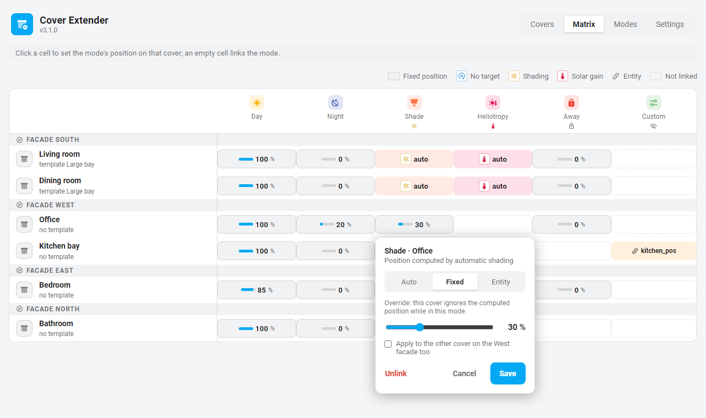
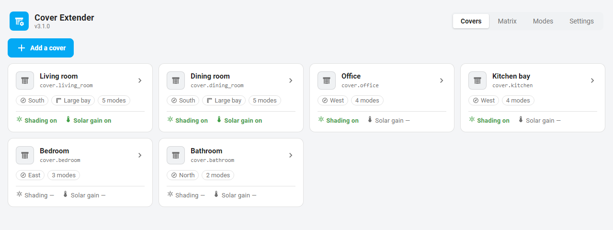
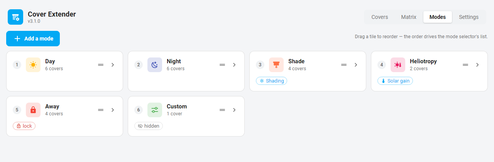
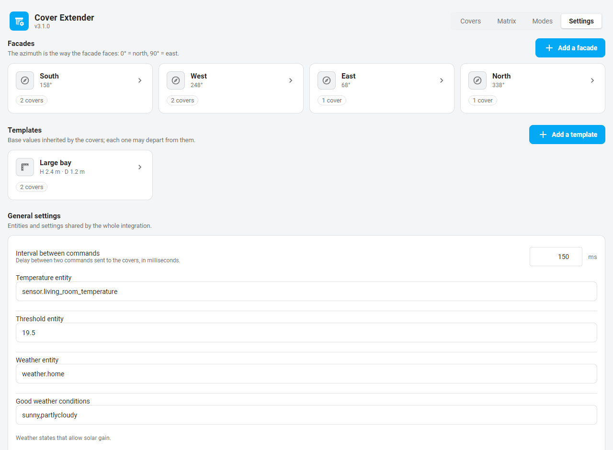

# Cover Extender

Cover Extender is a Home Assistant custom integration that enriches existing cover (blind/shutter) entities with advanced automation features: mode management, automation lock, persistent memory, autonomous solar shading, and solar gain optimization — all without replacing or duplicating your cover entities.

The integration injects attributes, creates helper entities, computes shading and sun-facing data, and orchestrates all logic in a lightweight, non-destructive architecture.

---

## 🧠 Philosophy of the Component

Cover Extender is built on a simple idea: **automation should enhance control, not replace it**.

Rather than introducing new cover entities or abstracting your hardware behind opaque logic, Cover Extender **extends what already exists**. Your original `cover.*` entities remain the single source of truth. The integration adds intelligence *around* them — never *over* them.

---

### 🎯 Intention First, Mechanics Second

Traditional automations often bind **conditions directly to actions**:

> *If sun elevation > X → move cover to Y*

While effective, this approach quickly becomes hard to reason about, override, or debug.

Cover Extender takes a different path:
- You express **intent** using **modes**
- Each mode defines *context* (lock, behavior, strategy)
- Automation logic only runs **when explicitly allowed**

A mode answers the question:

> *"What is this cover supposed to do right now?"*

Not:

> *"Which automation happens to fire?"*

---

### 🧩 Non‑Destructive by Design

Cover Extender follows a strict rule:

> **It never replaces, clones, or takes ownership of your covers.**

Instead, it:
- injects attributes
- creates helper entities (selects, switches, sensors)
- orchestrates commands through a controlled layer

At any moment:
- You can bypass Cover Extender and control the cover manually
- A reboot or reload never corrupts native cover state
- Removing the integration restores a clean system

Your hardware remains autonomous. Cover Extender is optional intelligence.

---

### 🔐 Safety Over Surprise

Unintended physical movement is one of the most common frustrations with cover automations.

Cover Extender treats this as a **first‑class concern**:

- **Lock** prevents movement — not just automation
- **Exclusion entities** (e.g. open windows) block commands safely
- **Target positions are remembered**, not lost
- Nothing "catches up" later without your consent

If a cover does not move, it is never a mystery:

> *It is either locked, excluded, or waiting in memory.*

---

### 🧠 Memory Instead of Guesswork

When automation is paused, many systems simply… give up.

Cover Extender does not.

- Every mode change saves the current position
- Blocked movements are intentionally memorized
- Unlocking applies memory only when movement is safe

This creates **continuity of intent**:

> *"I wanted this position — apply it when possible."*

Not:

> *"Automation failed, state lost."*

---

### 🌞 Sun Automation as a Strategy, Not a Reflex

Solar logic in Cover Extender is **deliberate, not reactive**.

- Sun data is always computed
- But actions only occur when:
  - the corresponding automation switch is ON
  - usually enabled by a mode

There is no background process constantly fighting the user.  
Sun automation is:
- scoped
- reversible
- visible

You decide *when* the sun matters.

---

### 🧠 Explicit Is Better Than Clever

Cover Extender intentionally avoids:
- hidden assumptions
- implicit behavior chains
- "smart" actions with no clear trigger

Instead, it favors:
- explicit modes
- visible switches
- deterministic state changes
- Home Assistant events for external orchestration

Everything it does is:
- observable
- debuggable
- reversible

---

### 🤝 A Good Home Assistant Citizen

Cover Extender respects Home Assistant's ecosystem:

- Full UI configuration via an embedded admin panel
- Hot reload, no restart required
- Native entities, services, and events
- Plays well with dashboards and automations
- No cloud, no polling hacks, no side effects

It aims to feel like:

> *"Something Home Assistant could have shipped — if covers were modes‑aware."*

---

### ✅ In One Sentence

**Cover Extender does not automate covers for you — it gives you the tools to express intent, safely, predictably, and on your own terms.**

---

## ✨ Features

- **Admin panel**  
  All configuration happens in a dedicated panel at `/cover-extender`: covers, modes, facades, templates and global settings, plus a **matrix** view (modes × covers) where every per-cover position is one click away.

- **Mode system**  
  Named modes with icons, colors, lock, and an optional `behavior` field (`auto_shade` or `solar_gain`). A behavior computes the position; any single cover can still override it with a fixed or entity-driven position.

- **Automation lock**  
  Prevents physical moves; requested positions are stored in memory until unlocked.

- **Position memory (persistent)**  
  Automatically saved when changing mode. Stored in `.storage/cover_extender.memory`.

- **Autonomous solar shading**  
  Computes optimal cover position based on sun azimuth, elevation, facade geometry, and shade configuration.

- **Solar gain optimization**  
  Temperature‑ and weather‑aware auto‑positioning to capture or block heat.

- **Cover templates**  
  Reusable angle + shade/solar-gain settings shared across multiple covers. Editing a template propagates automatically to every cover that references it.

- **Attribute injection**  
  `facade`, `modes`, `auto_shade`, `sun_facing`, and `memory` are added to each cover entity.

- **Optional binary sensors**  
  `sun_facing`, `auto_shade`, and `solar_gain` can be exposed as binary sensors.

- **Dynamic entity creation**  
  Selects, switches, and binary sensors appear/disappear automatically after reload.

- **Hot reload**  
  Reload configuration without restarting Home Assistant.

- **Command throttling**  
  All physical cover commands are queued with a configurable delay (default 150 ms) to prevent hardware saturation.

- **HA bus events**  
  `cover_extender_mode_changed`, `cover_extender_memory_saved`, and `cover_extender_shade_applied` are fired automatically, enabling external automations to react to Cover Extender state changes.

- **Rename-proof**  
  Covers are tracked by their immutable entity registry id: renaming a cover (or any helper entity) in HA breaks nothing — configuration, memory and automations follow automatically.

---

## 📦 Installation

1. Copy the `cover_extender/` folder into `custom_components/`.

2. Restart Home Assistant.

3. Go to **Settings → Integrations → Add integration** and search for **Cover Extender**. The config flow creates the entry and stops there.

4. Open the **Cover Extender** panel to configure everything else: from the sidebar (each user can show or hide the entry via the sidebar editor), from the button on the integration page, or directly at `http://your-ha:8123/cover-extender`.

> Requires Home Assistant 2026.1 or later.

**Upgrading from 2.x:** the stored configuration migrates automatically at first startup (config subentries are lifted into the entry options). The migration is one-way - a later downgrade to 2.x is refused rather than risking corruption.

---

# 🧾 Configuration

All configuration is managed in the **admin panel** at `/cover-extender`. The panel talks to the integration through two admin-only WebSocket commands; every value is validated server-side and persisted into the config entry, and each save hot-reloads the integration - no restart, ever.

The panel has four tabs:

| Tab | What it edits |
|---|---|
| **Covers** | The cover profiles: entity, facade, template, exclusion, shading and solar-gain parameters. |
| **Matrix** | Modes × covers: link modes and set every per-cover position from one grid. |
| **Modes** | The modes: icon, color, lock, behavior, visibility. Drag to reorder - the order drives the mode selectors. |
| **Settings** | Facades, cover templates, global settings, and a count of the entities all this produced. |

## The matrix

The matrix is the heart of the panel - the screen a config flow could never draw:


Each cell is the position of one mode on one cover. Click a cell to edit it, an empty cell to link the mode; deleting and renaming stay safe (a facade, template or mode still referenced by covers cannot be deleted, and renames cascade). The cell popover offers three choices - **Fixed** (slider), **Entity** (an `input_number`/`number` whose value drives the position live) and **None** - plus a one-tick "apply to the whole facade".

On a mode with an `auto_shade` or `solar_gain` behavior, the position is computed, so cells show `auto`. Since 3.1.0 the same popover can **override the computation for a single cover**: pick Fixed or Entity and that cover ignores the computed position while in this mode (its auto switches stay off, lock and memory follow the mode's own lock flag). The other covers keep the computed position. In the screenshot above, *Shade* computes everywhere except on *Office*, pinned at 30 %:



The panel follows your Home Assistant theme ([dark version](docs/panel-matrix-dark.png)) and each admin reads it in their own language (English and French shipped).

## The other tabs

| | |
|---|---|
|  |  |



---

## Facades

A facade defines the compass orientation of a wall in degrees (0 = North, 180 = South). It is referenced by each cover to compute sun-facing status and shading geometry.

---

## Modes

Each mode defines the context in which a cover operates:

| Field | Description |
|---|---|
| `name` | Unique identifier (e.g. Day, Shade, Night). |
| `icon` | MDI icon name (e.g. `mdi:white-balance-sunny`). |
| `color` | Hex color for dashboards (e.g. `#FF8F00`). |
| `lock` | Whether the cover is locked in this mode. |
| `behavior` | `auto_shade`, `solar_gain`, or none. Determines which automation switch is activated. |
| `hidden` | If `true`, the mode is excluded from the global mode selector. |

`auto_shade` and `solar_gain` are mutually exclusive per mode.

A behavior computes the position for every linked cover - unless a cover carries its own fixed or entity position for that mode (set in the matrix), in which case that cover is driven by its stored position instead of the computation.

---

## Cover templates

A **cover template** groups the physical-window parameters that are identical for several covers, avoiding repetition. It acts as a **live reference**: editing a template immediately propagates its values to all covers using it.

**Template parameters:**

| Parameter | Description |
|---|---|
| `name` | Unique template name. |
| `angle_left` / `angle_right` | Sun azimuth offset (°) relative to the facade normal. |
| Shade parameters | `distance`, `max_height`, `min_height`, `degrees`, `min/max_elevation`, positions, threshold, timeout. |
| Solar-gain parameters | `position_cold`, `position_solar`. |

**When to use a template:**  
If two or more covers have the same physical window geometry and the same shading/solar-gain parameters, create one template and reference it from each cover. If a cover has unique characteristics, configure it without a template.

---

## Covers

Each cover profile links a `cover.*` entity to its facade, modes and automation settings. The cover editor (Covers tab) groups them in collapsible sections:

### Identity
- Cover entity, optional image path (host-relative, e.g. `/local/…`), facade, optional cover template, exclusion entities.

### Modes
- Which modes apply to this cover, and each mode's target position: fixed integer (0-100), `auto` (no fixed position; on a behavior mode this means "computed"), or an entity ID read at runtime. Also editable cell by cell in the matrix.

### Geometry, detection, shading, solar gain
All shade and solar-gain parameters for this cover. With a template, the template's values show as the effective baseline and the cover only stores its deviations:

**Shade (`shade`):**

| Parameter | Default | Description |
|---|---|---|
| `enable` | `false` | Activate autonomous shading. |
| `distance` | `0.4` m | Horizontal distance to the obstacle (e.g. balcony depth). |
| `max_height` | `1.8` m | Maximum shadow height to cast on the window. |
| `min_height` | `0.0` m | Minimum shadow height; below this, the cover opens. |
| `degrees` | `90` ° | Azimuth window within which the sun triggers shading. |
| `max_elevation` | `90` ° | Above this elevation the cover is not moved. |
| `min_elevation` | `5` ° | Below this elevation the cover is not moved. |
| `minimum_position` | `15` % | Floor position during shading. |
| `default_position` | `100` % | Position used when sun is outside the window. |
| `change_threshold` | `5` % | Minimum position delta before issuing a new command. |
| `time_out` | `2` min | Minimum delay since the last cover movement (from **any** source: Cover Extender, remote control, HA UI) before a new shading position is applied. Entering a shade mode bypasses it. |

**Solar gain (`solar_gain`):**

| Parameter | Default | Description |
|---|---|---|
| `enable` | `false` | Activate solar-gain optimization. |
| `position_cold` | `0` % | Position when conditions are cold or unfavorable. |
| `position_solar` | `100` % | Position when sun is facing and conditions are favorable. |

---

## Global settings

| Field | Description |
|---|---|
| `command_interval` | Delay (ms) between consecutive cover commands. Default `150`. |
| `show_sun_facing` | Create `binary_sensor.<cover>_sun_facing` for each cover. |
| `show_auto_shade` | Create `binary_sensor.<cover>_auto_shade`. |
| `show_solar_gain` | Create `binary_sensor.<cover>_solar_gain`. |
| Temperature entity | Sensor used to evaluate the solar-gain temperature threshold. |
| Temperature threshold | Static float **or** `input_number` entity ID, resolved at runtime. |
| Weather entity | `weather.*` entity used to check conditions. |
| Good conditions | Weather states that allow solar-gain positioning. |

---

# 🌞 Sun Facing

The attribute `sun_facing` is injected into each cover and automatically updated whenever:

- the sun's state changes  
- the cover updates  
- configuration reloads

Computation uses:

- facade azimuth  
- per-cover `angle_left` / `angle_right`  
- sun azimuth & elevation

---

# 🌓 Autonomous Solar Shading

Activated when:

- shade is enabled on the cover (or its template)  
- AND `switch.<cover>_auto_shade` is ON  
- (usually turned ON automatically by a mode with `behavior: auto_shade`)

Shading uses:

```
(distance / cos(gamma)) * tan(alpha)
```

And respects: sun FOV, `minimum_position`, `default_position`, `time_out`, `change_threshold`.

---

# 🌡️ Solar Gain Optimization

Active when:

- solar gain is enabled on the cover (or its template)
- AND `switch.<cover>_auto_solar_gain` is ON
- (usually turned ON automatically by a mode with `behavior: solar_gain`)

Behavior:

- If temperature ≥ threshold → no action  
- Else if sun_facing & weather good → `position_solar`  
- Else → `position_cold`

---

# 🔐 Mode System (Actual Behavior)

```
                     ┌────────────────────────┐
                     │        APPLY MODE      │
                     └────────────────────────┘
                                  │
                                  ▼
                  ┌─────────────────────────────────┐
                  │ Save CURRENT position to memory │
                  └─────────────────────────────────┘
                                  │
                                  ▼
         ┌─────────────────────────────────────────────┐
         │ Apply mode context                          │
         │ - lock on/off                               │
         │ - behavior: auto_shade / solar_gain / none  │
         │ - toggle automation switches                │
         └─────────────────────────────────────────────┘
                                  │
                                  ▼
                  ┌─────────────────────────────────┐
                  │ Is a target position defined ?  │
                  └─────────────────────────────────┘
                     YES │                       │ NO
                         ▼                       ▼
        ┌───────────────────────────┐   ┌────────────────────────┐
        │ Fixed / entity / memory   │   │ No direct movement     │
        │ target position resolved  │   │ Automation only        │
        └───────────────────────────┘   └────────────────────────┘
                         │
                         ▼
             ┌────────────────────────────────────┐
             │ Is physical movement allowed ?     │
             │ - lock OFF ?                       │
             │ - no exclusion entity ON ?         │
             └────────────────────────────────────┘
                   │ YES                      │ NO
                   ▼                          ▼
        ┌────────────────────────┐   ┌───────────────────────────┐
        │ Send cover command     │   │ Do NOT move cover         │
        │ (throttled queue)      │   └───────────────────────────┘
        └────────────────────────┘               │
                                                 ▼
                                     ┌─────────────────────────┐
                                     │ Store target in memory  │
                                     └─────────────────────────┘
```

Note: on a behavior mode (`auto_shade` / `solar_gain`), a cover that carries its own fixed or entity position for that mode skips the behavior entirely - its automation switches stay off and the flow above runs as for a plain position mode.
# 🔐 Lock System (Actual Behavior)
```
            ┌──────────────────────────┐
            │        UNLOCK            │
            │  (switch.lock → OFF)     │
            └──────────────────────────┘
                         │
                         ▼
     ┌────────────────────────────────────┐
     │ Is a memory position stored ?      │
     └────────────────────────────────────┘
                 │ YES              │ NO
                 ▼                  └────────────┐
 ┌─────────────────────────────────────┐         |
 │ Are exclusion entities all OFF ?    │         |
 └─────────────────────────────────────┘         |
               │ YES                 │ NO        |
               ▼                     ▼           ▼        
┌────────────────────────────┐   ┌────────────────────────────┐
│ Apply memorized position   │   │ DO NOTHING                 │
│ → physical move allowed    │   │ Memory kept                │
└────────────────────────────┘   └────────────────────────────┘
```

---

# 🧱 Injected Attributes

Injected into each cover entity:

- `facade`
- `modes`
- `auto_shade`
- `sun_facing`
- `memory` (if present)

Attributes update on each state change.

---

# 🧰 Entities Created Per Cover

| Entity | Purpose |
|--------|---------|
| `select.mode_<cover>` | Choose mode |
| `switch.<cover>_lock` | Automation lock |
| `switch.<cover>_auto_shade` | Autonomous shading switch |
| `switch.<cover>_auto_solar_gain` | Solar gain toggle |
| `binary_sensor.<cover>_sun_facing` | Optional (global settings) |
| `binary_sensor.<cover>_auto_shade` | Optional (global settings) |
| `binary_sensor.<cover>_solar_gain` | Optional (global settings) |

Global selector:

- `select.cover_extender_modes`

---

# 🔧 Services

### `cover_extender.set_cover_position`
Lock-aware positioning.

### `cover_extender.open_cover` / `close_cover`
Lock-aware 100% / 0%.

### `cover_extender.apply_mode`
Applies a mode to one or more covers.

Returns:
```json
{ "applied": [...], "skipped": [...] }
```

### `cover_extender.apply_memory`
Force applying stored memory.

### `cover_extender.compute_shade_position`
Returns:
```json
{ "position": <int>, "should_update": <bool> }
```

### `cover_extender.get_mode_position`
Reads configured mode position.

### `cover_extender.reload`
Reloads configuration without restarting Home Assistant.

---

# 🚨 Command Throttling

All physical `cover.*` commands are routed through a global queue and executed with a minimum delay between commands (default 150 ms, configurable via global settings).

Switch toggles are **not** throttled.

---

# 📡 HA Bus Events

Cover Extender fires the following events on the HA event bus, allowing external automations to react without polling entities:

| Event | Fired when | Payload |
|---|---|---|
| `cover_extender_mode_changed` | A mode is applied to a cover | `entity_id`, `mode`, `from_mode`, `position` |
| `cover_extender_memory_saved` | A position is stored in or cleared from memory | `entity_id`, `position` (`null` = cleared) |
| `cover_extender_shade_applied` | Auto-shade computes and enqueues a new position | `entity_id`, `position` |

Example automation trigger:

```yaml
trigger:
  - platform: event
    event_type: cover_extender_mode_changed
    event_data:
      mode: Night
```

---

# 🧪 Example Automation

```yaml
service: cover_extender.apply_mode
data:
  entity_id:
    - cover.living_room
  mode: Shade
```
